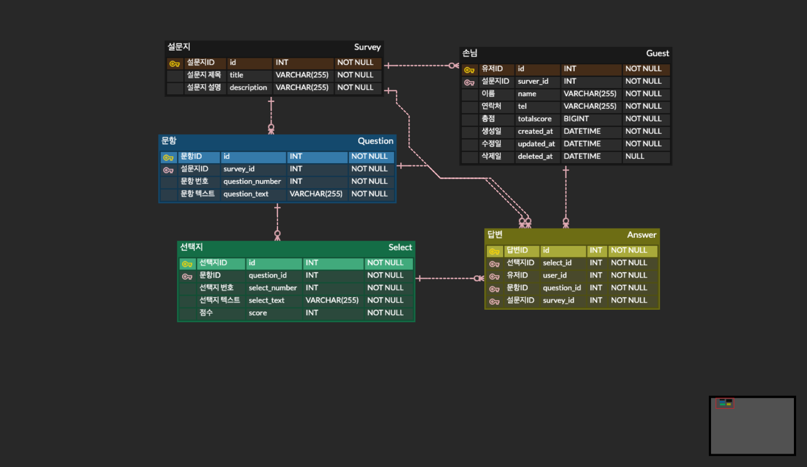

## Survey (설문지)

- 설문지 데이터베이스 설계



---

### 사용기술

 - TypeScript
 - NestJs
 - TypeORM
 - GraphQL
 - PostgreSQL
 - Docker

---

###  Server Use

```bash
npm run start:dev
```

### Install 
```
npm i | npm install
```

### Docker PostgreServer Port

- PostgreSQL은 5432포트로 많이 쓰지만, 본인은 5432포트를 다른 곳에 사용중이여서 바꿈
```
5433:5432
```

### DESC

- DB Postgre는 Docker를 이용해 사용했음
- 각 환경변수에 맞는 값들은 본인의 호스트 등 확인하여 입력
- localhost:4000 포트 사용
- env파일의 구조 (PG_NAME은 데이터베이스의 이름입니다.)
```
PG_HOST=
PG_USERNAME=postgres
PG_PASSWORD=
PG_PORT=5433
PG_NAME=
```

---

### 기능 설명

<details><summary>설문지 생성</summary>

- 설문지의 목적성과 유지보수 측면에서는 설문지생성을 트랜잭션 처리하는게 더 나을수도 있겠지만
성능저하등의 이유로 유연하고 직관적으로 하기 위해 각자의 로직에서 처리.
- 실행
```graphql
mutation{
  createSurvey(newSurvey:{ title:"세계여행을 간다면 어디로 가고 싶나요?",
                           description:"가고 싶은 여행지를 조사하는 설문지입니다!"})
  {  
    title
    description
  }
}
```

- 결과

```
{
  "data": {
    "createSurvey": {
      "title": "세계여행을 간다면 어디로 가고 싶나요?",
      "description": "가고 싶은 여행지를 조사하는 설문지입니다!"
    }
  }
}
```

</details>

<details><summary>답변 생성</summary>

- 선택지에 각 부여한 점수 표현
- questionSelects 배열로 묶음
- 실행

```graphql
mutation {
  createAnswer(createAnswerInput: {surveyId: 4, guestId: 4, 
  questionSelects: [{questionId: 4, selectId: 6}, {questionId: 5, selectId: 10}]}) {
    id
    guest {
      id
      totalScore
    }
    survey {
      id
    }
    question {
      id
    }
    select {
      id
      score
    }
  }
}
```

- 결과

```graphql
{
  "data": {
    "createAnswer": [
      {
        "id": 4,
        "guest": {
          "id": 4,
          "totalScore": 0
        },
        "survey": {
          "id": 4
        },
        "question": {
          "id": 4
        },
        "select": {
          "id": 6,
          "score": 1
        }
      },
      {
        "id": 5,
        "guest": {
          "id": 4,
          "totalScore": 0
        },
        "survey": {
          "id": 4
        },
        "question": {
          "id": 5
        },
        "select": {
          "id": 10,
          "score": 3
        }
      }
    ]
  }
}
```
</details>

<details><summary>설문자 조회</summary>

- Guest(설문자) 라는 테이블을 만듬.
- 설문지 ID별 조회를 하면 해당 설문에 참여했던 설문자들 조회.
- 설문자별 총점 확인.(선택지 변경시에도 점수 업데이트 반영됨)

```graphql
query {
  findGuestBySurveyId(surveyId: 4) {
    id
    name
    tel
    totalScore
   
  }
}
```

- 결과

```graphql
{
  "data": {
    "findGuestBySurveyId": [
      {
        "id": 3,
        "name": "홍길동",
        "tel": "010-1234-6789",
        "totalScore": 0
      },
      {
        "id": 4,
        "name": "테스트",
        "tel": "010-1234-5678",
        "totalScore": 4
      }
    ]
  }
}
```
</details>

---

## # 회고
GraphQL에 더 공부를 하게 된 것 같아서 좋았다.
<br>
처음엔 타입안정성이 좋은 prisma를 사용해 작업을 하려고 했지만, 요구사항에 TypeORM이 있어서
이대로 사용했고, 현재 진행중인 다른 사이드프젝을 끝내고
<br>
GraphQL과 prisma등 다양한 기술들을 이용해 새로운것을 시도해봐야겠다.


